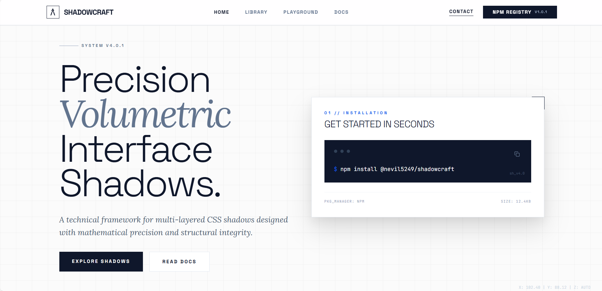
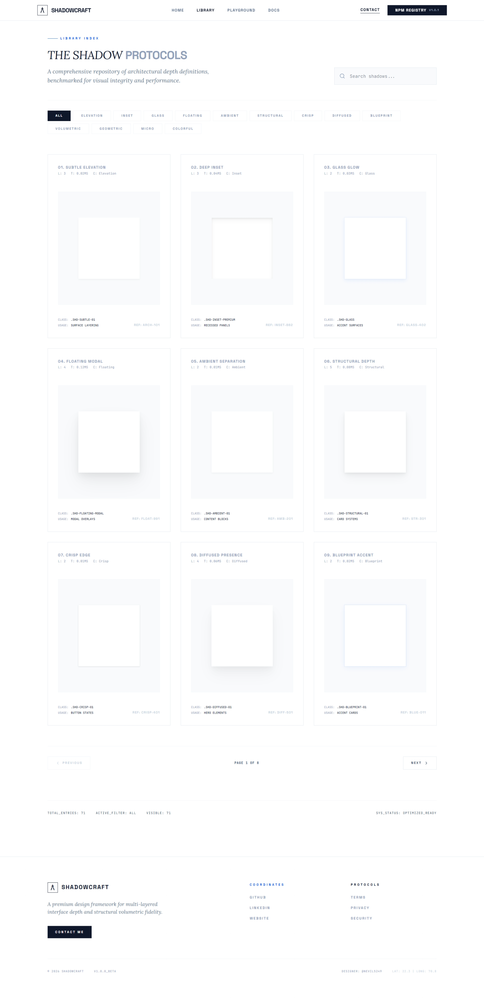
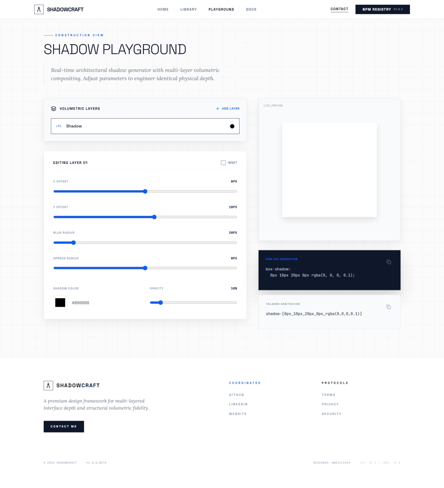
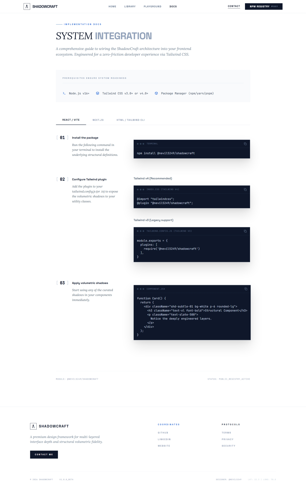

# ShadowCraft

<p align="center">
  Precision Volumetric Shadow System for Tailwind CSS
</p>

<p align="center">
  <a href="https://www.npmjs.com/package/@nevil5249/shadowcraft">
    
  </a>
  <a href="https://www.npmjs.com/package/@nevil5249/shadowcraft">
    
  </a>
  <a href="https://shadowcraft.nevilgadhia.in">
    
  </a>
  
</p>

------------------------------------------------------------------------

## Overview

ShadowCraft is a professional Tailwind CSS plugin that introduces
architecturally structured, multi-layered shadow systems designed for
modern UI depth.

Website: https://shadowcraft.nevilgadhia.in

------------------------------------------------------------------------

# Sections

## Home

Landing page introducing ShadowCraft philosophy.



------------------------------------------------------------------------

## Library

Browse all volumetric shadows.



------------------------------------------------------------------------

## Playground

Interactive testing environment.



------------------------------------------------------------------------

## Docs

Integration and usage guide.



------------------------------------------------------------------------

# Installation

``` bash
npm install @nevil5249/shadowcraft
```

------------------------------------------------------------------------

# Usage

## Tailwind v4 (Recommended)

Add to CSS:

``` css
@import "tailwindcss";
@plugin "@nevil5249/shadowcraft";
```

------------------------------------------------------------------------

## Tailwind v3

Add to tailwind.config.js:

``` js
module.exports = {
  plugins: [
    require('@nevil5249/shadowcraft')
  ],
}
```

------------------------------------------------------------------------

# Example

``` html
<div class="shd-subtle-01 bg-white p-6 rounded-lg">
  ShadowCraft Component
</div>
```

------------------------------------------------------------------------

# Playground

https://shadowcraft.nevilgadhia.in/playground

------------------------------------------------------------------------

# Documentation

https://shadowcraft.nevilgadhia.in/docs

------------------------------------------------------------------------

# NPM

https://www.npmjs.com/package/@nevil5249/shadowcraft

------------------------------------------------------------------------

# Author

Nevil Gadhia

GitHub: https://github.com/nevil5249

Website: https://nevilgadhia.in

------------------------------------------------------------------------

# License

MIT License

------------------------------------------------------------------------

Built with precision by Nevil Gadhia